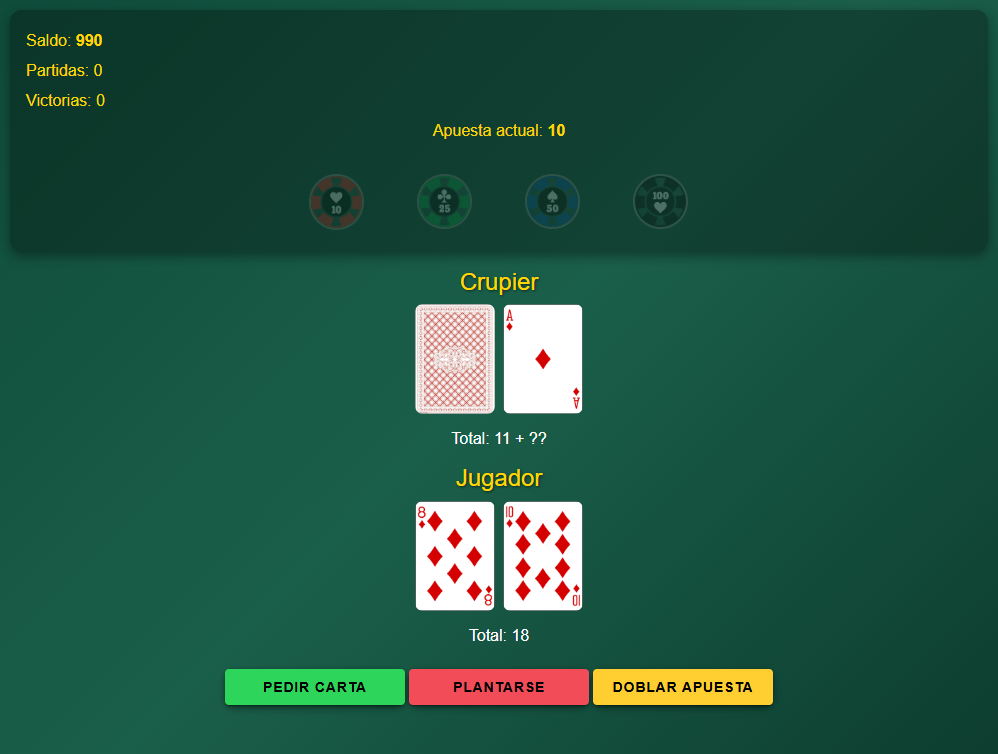
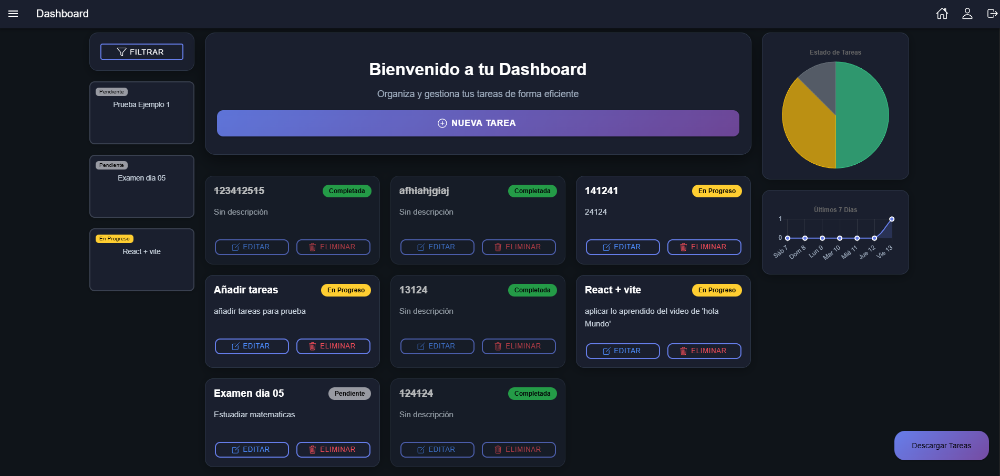

    
  

###

  
  
  
  
  
  
  
    
  
  
  
  
  
  
  

###

<picture>
  <source media="(prefers-color-scheme: dark)" srcset="https://raw.githubusercontent.com/BryanJChuquimarca/BryanJChuquimarca/output/pacman-contribution-graph-dark.svg">
  <source media="(prefers-color-scheme: light)" srcset="https://raw.githubusercontent.com/BryanJChuquimarca/BryanJChuquimarca/output/pacman-contribution-graph.svg">
  
</picture>

###

  
<b>Juego de BlackJack</b>

  
  
Link: https://juegodecartas-blackjack.web.app

  
<b>DashBoard</b>

  
  
Link: https://dashboard-app-two-sandy.vercel.app/

